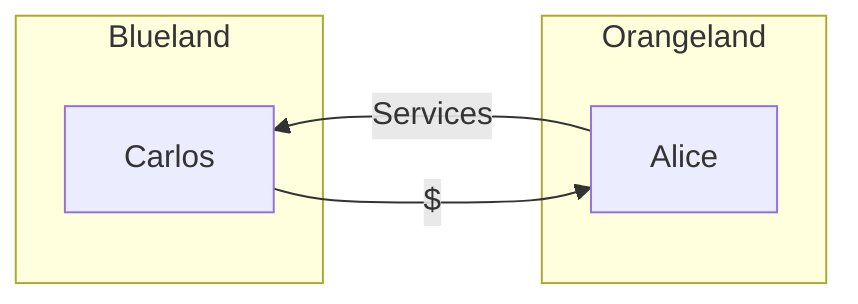
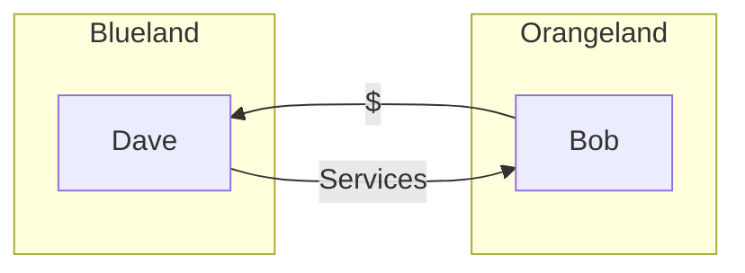
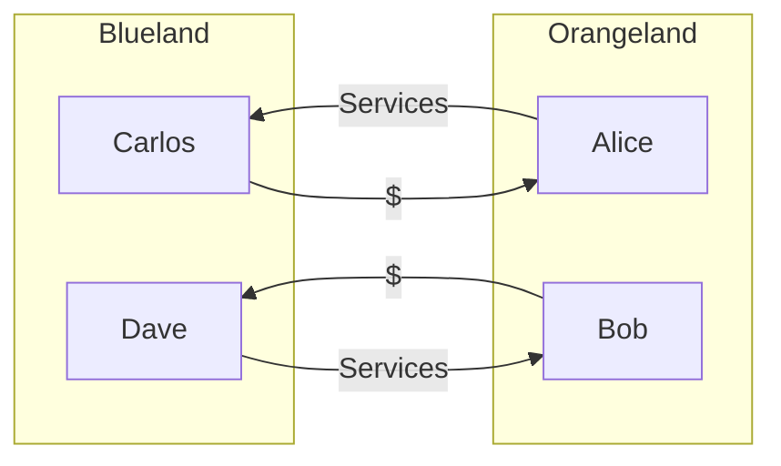
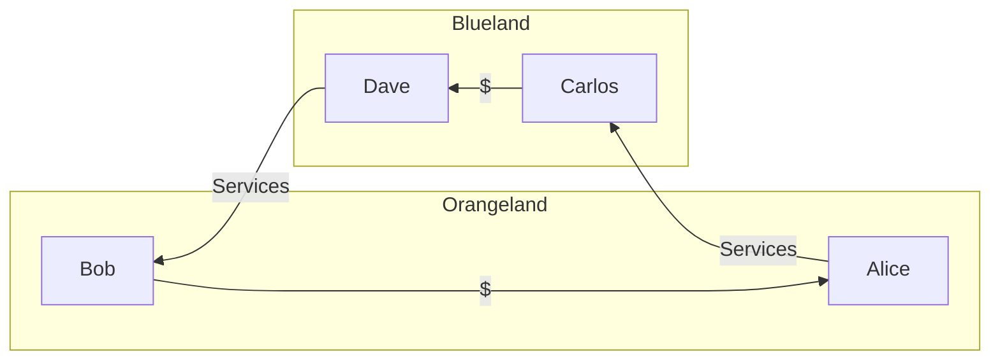

# About Gap

**Gap** a tool for sharing formation about payments in the public space. **Gap**
minimizes or elliminates cross-border payments. The system builds on voluntary
exchange of the information about planed transactions. Any physical or a
representative of a legal entity can leave information about planned payments. Gap
stores this information and makes it available to other users upon request.

## How it works

Gap receives information from users about planned payments between different regions. Suppose Alice, who lives in the 
Orangeland region, provides services to Carlos, who lives in the Blueland region. Carlos makes a cross-border payment.

At the same time, Dave from Blueland is waiting for money from Bob from 
Orangeland for services.

Alice and Bob live in the same region but do not know each other. The same goes for
Carlos and Dave. To complete the transaction, the parties must make two cross-border
payments.

Gap invites the parties to meet and make settlements as follows:

Thus, only services and goods pass through the border between Orangeland 
and Blueland. Transactions carried out in the regions. The issue of 
transactions between the parties is at the discretion of the participants. Gap performs exclusively informational 
function and acquaints the parties.

## Search offers

To search for a pair trade, the user must provide the following information:

- The amount of the planned payment
- Payment currency
- Region of the payer
- Recipient's region

Gap will match paired trades if available. The user leaves contacts for transactions of interest. In case the search is
not gave results, the user can leave a request, which will be displayed to other participants.

## Offer

To apply, you will need all the data specified in the search, and the contact of the participant who left the
application. It is this contact that will be presented to other users on the next search. A deal is registered every
time a user leaves a contact.

Gap will start publishing a new offer immediately.

## Registration

Gap does not require registration. All credentials are based on a link that you can get in any **Copy** option. The loss
of the link is tantamount to the loss of information on your orders and transactions.

