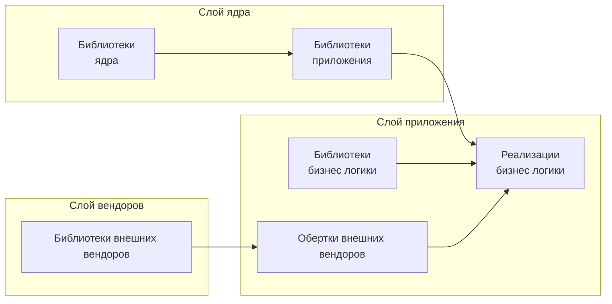

# Архитектура сервиса

1. Раздел описывает принципы и правила сервисов в рамках МСА в общем и 
[MSASIE](./msamsie.md) в частности.

# Задачи

1. Архитектура призвана решитьследующие задачи:
    1. Минимизация объема кода.
    0. Сокращение времени разработки.
    0. Повышение безопасности приложения.
    0. Снижение зависимости приложения от внешних изменений.
    0. Независимость приложения от среды.

# Описание

1. Все сервисы реализуются как единообразное приложение включающее следующие слои:
    1. [Слой ядра](#Слой-ядра);
    0. [Слой приложения](#Слой-приложения);
    0. [Слой внешних компонентов](#Слой-внешних-компонентов).

# Слой ядра

1. Слой ядра включает компоненты, необходимые для функционирования приложения:
    1. Запуск и завершенеи приложения;
    0. Журналирование;
    0. Мониторинг;
    0. Конфигурирование;
    0. Запуск модулей бизнес-логики [rig](./glossary/rig.md).

## Слой приложения

1. Слой включает компоненты, необходимые для исполнения бизнес логики:
    1. Библиотеки бизнес логики.
    0. Обертки для библиотек внешних вендоров.
    0. Непосредственно реализацию бизнес логики [rig](./glossary/rig.md).

## Слой внешних вендоров

1. Слой включает допустимые библиотеки внешних вендоров.

# Ссылки

1. [MSASIE](./msamsie.md) 
