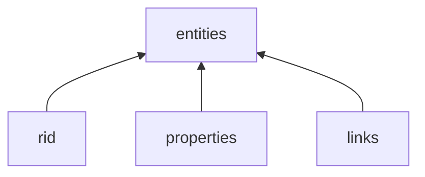
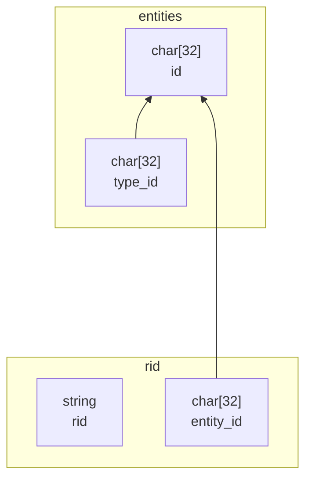
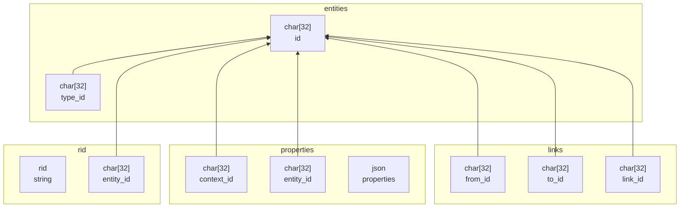
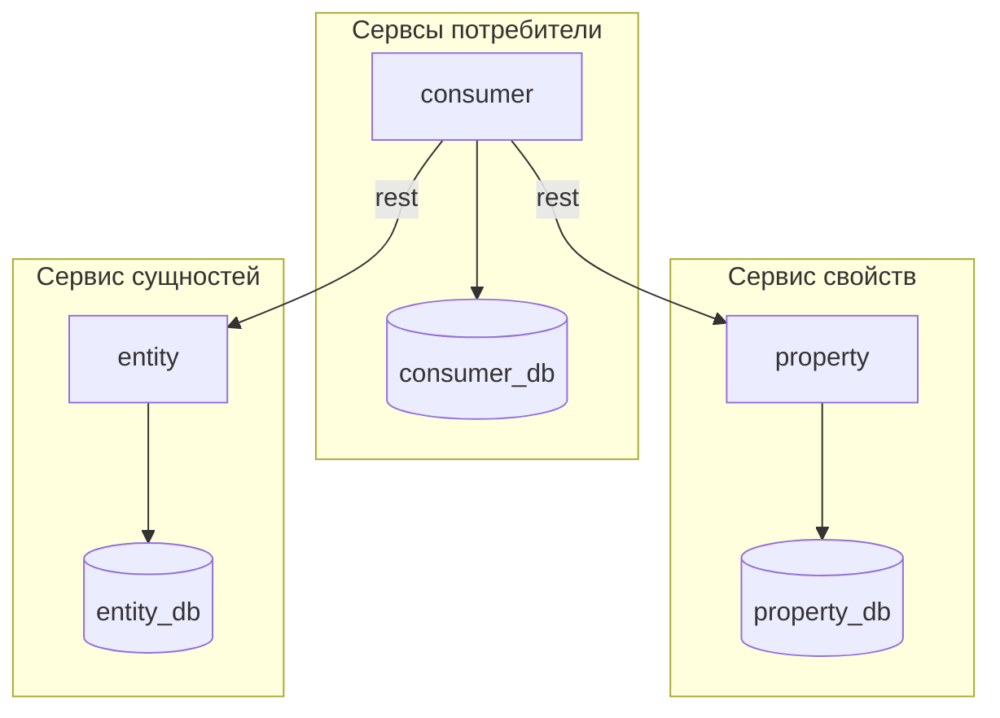

# Архитектура сущностей Catlair

1. [Cущности](./glossary/Сущности.md) - средство описания объектов, 
явлений и понятий реального мира. Сущность следует рассматривать как абстрактный 
элемент, для описания свойств.
0. Предлагаемый ниже способ описания информации позволяет создать универсальное 
хранилище сущностей для распределенных систем. 


# Оглавление
1. [Авторы](#авторы)
0. [Теория](#теория)
0. [Практика](#практика)
0. [Резюме](#резюме)
0. [Организация-хранения-сущностей](#организация-хранения-сущностей)
    1. [Реляционное хранилище сущностей](#Реляционное-хранилище-сущностей)
        1. [Отношение entities](#Отношение-entities)
        0. [Отношение rid](#Отношение-rid)
        0. [Расширенная диаграмма отношений](#Расширенная-диаграмма-отношений)
    0. [Сервисы](#Сервисы)
    0. [Методы взаимодействия с сущностью](#Методы-взаимодействия-с-сущностью)
        1. [define](#define)
        0. [check](#check)
        0. [kill](#kill)
        0. [id2rid](#id2rid)
        0. [rid2id](#rid2id)


# Авторы

1. Концепт разработан и применен в проекте [catlair](http://catlair.net/) 
2001-2019 под лицензией [gplv3](https://www.gnu.org/licenses/gpl-3.0.en.html).
0. Авторы концепта:
    1. https://github.com/johnthesmith/
    0. https://github.com/igptx


# Теория

1. Для сущности неоходимо минимально определить:
    1. факт существования;
    0. тип сущности. 
0. Все иные описания и свойства сущности следует признать вторичными,
а именно:
    1. связь сущностей между собой;
    0. контестозависиме и независимые атрибуты сущности.
0. Следует определить операции с сущностью:
    1. [Создание сущности](#define)
    0. [Проверка существования](#exists)
    0. [Удаление сущности](#kill)


# Практика

1. Для хранения созданных сущностей потребуется отношение кортежей со следующими 
атрибутами:
    1. id - идентификатор сущности;
    0. type - идентификатор типа сущности ( который в свою очередь является сущностью ).
2. Так как [условлена](#теория) невозможность определения сущности без типа,
следует определить первую корневую самотипизирующуюся сущность:
```
{
    "entities":
    {
        "id":"entities",
        "type":"entities"
    }
}
```

> ⚠️ **Важно!** Определение кортежа фактически создает новый домен, развиваемый 
> добавлением сущностей и описанием их свойств.

Далее добавляем новые сущности:

```
{
    "entities":
    [
        ...,
        { "id":"animal",    "type":"entities" },
        { "id":"human",     "type":"animal" },
        { "id":"cat",       "type":"animal" }
    ]
}
```
3. Для описания связей между сущностями необходим дополнить перечень сущностей
типом связь и видом связи:
```
{
    "entities":
    [
        ...,
        /* Добавили новую сущность - связь */
        { "id":"link",      "type":"entities" },
        /* Добавили типы связи как сущность */
        { "id":"pet",       "type":"link" },
        { "id":"host",      "type":"link" }
    ]
}
```
Теперь возможно определять кортежи связей вида, при этом все значения
атрибутов являются сущностями:
```
{
    "links":
    [
        /* Кот является домашним животным человека */
        { "idFrom":"cat", "idLink":"pet", "idTo":"human" },
        /* Челове является хозяином кота */
        { "idFrom":"human", "idLink":"host", "idTo":"cat" }
    ]
}
```
4. Все сущности могут обладать различными атрибутами, включая абсолютные (не 
зависящие от контекста например вес), и контекстозависимые (например название на 
различных языках). Для описания языков создадим новые сущности:
```
[
    "entities":
    [
        ...
        /* Добавили новую сущность - язык */
        { "id":"lang", "type":"entities" },
        /* Добавили два языка, соответсвенно русский и английский */
        { "id":"ru", "type":"lang" },
        { "id":"en", "type":"lang" }
    ]
]
```
5. Далее возможно определить контекстозависимые и контекстонезависимые атрибуты 
сущностей:
```
[
    "properties":
    [
        {
            "entityId":"man",
            "propertyId": null,
            "properties":
            {
                "weightKg":80,
                "heightSm":180
            }
        },
        {
            "entityId":"man",
            "propertyId": "ru",
            "properties":
            {
                "firstName":"Джон",
                "lastName":"Смит",
            }
        },
        {
            "entityId":"man",
            "propertyId": "en",
            "properties":
            {
                "firstName":"John",
                "lastName":"Smith",
            }
        },
        {
            "entityId":"man",
            "propertyId": null,
            "properties":
            {
                "weightKg":80,
                "heightSm":180
            }
        },
        {
            "entityId":"cat",
            "propertyId": "ru",
            "properties":
            {
                "firstName":"Пуса"
            }
        },
        {
            "entityId":"cat",
            "propertyId": null,
            "properties":
            {
                "weightKg":4.5
            }
        }
    ]
]
```

## Резюме

1. Итого не выходя за пределы тероретической модели единообразно описаны 
разнородные сущности, связи между ними, контексты в которых эти сущности 
описываются и их атрибуты.

<details>
  <summary>Пример описание сущностей</summary>

```
{
    "entities":
    [
        { "id":"entities",  "typeId":"entities" },
        { "id":"animal",    "typeId":"entities" },
        { "id":"human",     "typeId":"animal" },
        { "id":"cat",       "typeId":"animal" }
        { "id":"link",      "typeId":"entities" },
        { "id":"pet",       "typeId":"link" },
        { "id":"host",      "typeId":"link" }
        { "id":"lang",      "typeId":"entities" },
        { "id":"ru",        "typeId":"lang" },
        { "id":"en",        "typeId":"lang" }
    ],
    "links":
    [
        { "fromId":"cat",   "linkId":"pet",     "toId":"human" },
        { "fromId":"human", "linkId":"host",    "toId":"cat" }
    ],
    "properties":
    [
        {
            "entityId"  :"human",
            "contextId" :null,
            "properties":
            {
                "weightKg":80,
                "heightSm":180
            }
        },
        {
            "entityId":"human",
            "contextId": "ru",
            "properties":
            {
                "firstName":"Джон",
                "lastName":"Смит",
            }
        },
        {
            "entityId":"human",
            "contextId": "en",
            "properties":
            {
                "firstName":"John",
                "lastName":"Smith",
            }
        },
        {
            "entityId":"cat",
            "contextId": "ru",
            "properties":
            {
                "firstName":"Пуса"
            }
        },
        {
            "entityId":"cat",
            "contextId": null,
            "properties":
            {
                "weightKg":4.5
            }
        }
    ]
}
```
</details>

> ℹ️ **Информация** Дальнейшие разделы являются исключительно одной из возможных 
> реализаций.


# Организация хранения сущностей

1. Хранение и обработку сущностей можно осуществлять различными средствами:
    1. [Реляционные БД](#Хранилище-сущностей-на-реляционнй-БД).
    0. Хранилище ключ:значение;


## Реляционное хранилище сущностей

1. Для индентификации сущностей следуте использовать:
    1. читаемый идентификатор сущности rid (readable id)
    0. идентификатор сущности в зависимости
2. В базовом варианте для хранения сущностей следует определить два 
[отношения](https://ru.wikipedia.org/wiki/%D0%9E%D1%82%D0%BD%D0%BE%D1%88%D0%B5%D0%BD%D0%B8%D0%B5_(%D1%80%D0%B5%D0%BB%D1%8F%D1%86%D0%B8%D0%BE%D0%BD%D0%BD%D0%B0%D1%8F_%D0%BC%D0%BE%D0%B4%D0%B5%D0%BB%D1%8C)):
    1. [entities](#отношение-entities) - сущности;
    0. [rid](#отношение-rid) - читаемые идентификаторы.
3. Дополнительно необходимы отношения:
    1. [properties](#) - контекстозависимые свойства сущностей;
    0. [links](#) - связи сущностей.




### Отношение entities

1. Отношение хранит перечень всех сущностей и типизирует их.
0. Содержит следующие атрибуты:
    1. char[32] id - уникальный идентификатор сущности, выбор способа создания 
    идентфикатора рассматривается [отдельно]().
    0. char[32] type_id - идентификатор типа сущности, ссылается на id.
0. Предпочтение отдается операциям insert.
0. Допустима операция update, выполняющая запись в атрибут type_id значения null 
для логического удаления сущности.
0. Отношение предполагает существенную мощность.

### Отношение rid

1. Отношение хранит читаемый идентификатор сущностей.
0. Содержит следующие атрибуты:
    1. char[32] entity_id - идентициатор сущности из отношения entities.
    0. string rid - текстовое представление читаемого идентификатора сущности.
0. Предпочтение отдается операциям insert, отношение не предполагает update и delete.
0. Отношение предполагает сравнительно не большую мощность по сравнению с entities, так как 
количество читаемых идентификаторов обычно ограничинно. 

### Краткая диаграмма отношений

1. Следующая диаграмма представляет выше описанные отношения.




### Расширенная диаграмма отношений

1. Указанную краткую диаграмму допустимо расширить дополнительными отношениями
для описания связей между сущностями и контекстным описанием свойств сущностей.



# Сервисы

1. Общий объем информации по сущностям следует разделить на следующие микросервисы:
    1. сервис entity - обслуживает отношения entity и id;
    0. сервис propery - обслуживает вторичны отношения link и property;
    0. множество сервисов conumer - реализуют бизнес функционал.




# Методы взаимодействия с сущностью

1. Реализцаяи предполагает следующие методы:
    1. [define](#define) - определение сущности;
    0. [check](#check) - проверка существования сущности;
    0. [kill](#kill) - удаление сущности.
    0. [id2rid](#id2rid) - разрешение идентификатора сущности в читаемый идентификатор.
    0. [rid2id](#rid2id) - разрешение читаемого идентификатора в идентификатор сущности.
0. Указанные методы опционально могут использовать [многомерное представление].


## define

1. Метод define устанавливает (типизирует сщность).
2. В случае 
    1. если сущность отсутствовала, она определяется.
    0. если сущность существовала
        1. и при этом обладала тем же типом, возвращается положительный результат.
        2. и при этом с иным типом, возвращается сообщение об ошибке.

### aргументы define

1. Метод define принимает следующие аргументы:
    1. ```string id``` - Идентификатор сущности;
    2. ```string itType``` - идентификатор типа сущности;

### результат define

1. Метод define возвращает структуру состояний результата.

### алгоритм define

```
json define
(
    /* Идентификтаор типа сущности */
    string ridType, 
    /* Опциональный идентификатор сущности */
    string rid = null,
)
{
    switch( algorithm )
    {
        AUTOINCREMENT:
        {
            /*
                Механизм идентификации на основе автоинкремента 
            */
            /* Получаем очередной автоинкрементный индекс */
            id = max( id ) + 1;
            /* Получаем идентификатор типа если он существует */
            idType = rid 
            -> select({ caption == ridType }) 
            -> get( "endity_id" );
        }
        HASH:
        {
            /*
                Механизм идентификации на основе hash
            */
            /* Вычисляем hash для идентификатора сущности */
            id = hash( rid == null ? getId() : rid );
            /* Вычисляем hash для типа сущности */
            idType = hash( ridType );
            if( !entities -> exists( idType ))
            {
                idType = null;
            }
        }
    }

    if( idType != null )
    {
        /* Проверяем наличие rid для его опциональной регистрации ... */
        if( rid != null && rid -> exists( rid ))
        {
            /* ... и если rid не обнаружен регистрируем его  */
            rid -> insert( "entity_id":id, "rid":rid );
        }

        /* Создаем сущность с идентфикатором id */
        entities -> insert( "id":id, "type_id":idType );

        /* Возвращаем положительный результат с новым идентификатором сущности */
        result = { "code":"ok", "id":id };
    }
    else
    {
        if( rid == ridType )
        {
            /* Регистрируем новый домен */
            rid -> insert( "entity_id":id, "rid":rid );
            entities -> insert( "id":id, "type_id":id );            
            result = { "code":"ok", "id":id };
        }
        else
        {
            /* Информируем пользователя об отсутсвии сущности */
            result = { "code":"unknown_type" );
        }
    }
}
```


## check

1. Метод check возвращает тип сущности в случае, если она была определена или 
пустой результат в противном случае.

### aргументы check

1. Метод check принимает следующие аргументы:
    1. ```char32 id``` - Идентификатор сущности;

### результат check

1. Метод define возвращает структуру состояний результата c указанием типа 
сущности.

### алгорим check

```
json check
(
    /* Идентификатор сущности */
    char32 id
)
{
    /* Выполняем поиск сущности по идентификатору */
    dataset = entities -> select({ "id":id });

    /* Проверка результата поиска ... */
    if( dataset != null )
    {
        /*
            Запись найдена, выполняем определение типа из кортежа
        */
        idType = dataset -> get( "type_id ");
        /* Проверка наличия типа */
        if idType == null )
        {
            /* Тип не указан, cущность была удалена */
            result = { "code":"entities_not_found" }
        }
        else
        {
            /* 
                Удалось определить идентификатор тип и необходимо
                получить его название
            */
            datasetRid = rid -> select({ "entity_id": idType });
            if( datastRid != null )
            {
                /* Возвращаем тип результата */
                result = 
                {
                    "code":"ok", 
                    "ridType":datasetRid -> get( "rid" ),
                    "idType":idType
                };
            }
            else
            {
                /* 
                    Имя типа сущности не найдено что является 
                    исключительной ситуацией 
                */
                result = { "code":"type_name_not_found" }
            }
        }
    }
    else
    {
        /* Сущность не найдена */
        result = { "code":"entities_not_found" }
    }
}
```


## kill

1. Метод kill пытается выпольнить логическое удаление сущности по идетификатору.
0. При наличии сущности она будет удалена с подтверждением результата удаления.
0. При отсутсвии сущности возвращается информация об отсутсвии.
0. Метод не пытается проверить целостность ссылок, а потому может быть удалена 
любая из сущностей.


### аргументы kill

1. Метод kill принимает следующие аргументы:
    1. ```array char32 idList``` - список идентификаторов сущностей для 
    удаления;

### результат kill

1. Метод kill возаращет положительный результ, если cущность после попытки 
удаления, и отрицательный результат если сущность осталась.


### алгоритм kill

``` 
bool kill
(
    /* Идентификаторы сущности для удаления */
    array char32 idList
)
{
    if
    (
        entities -> update
        (
            { "id":idList }, 
            { "type_id":null }
        )
    )
    {
        result = { "code":"ok" };
    }
    {
        result = { "code":"entity_not_found" };
    }
}
```


## rid2id

1. Метод rid2id возвращает rid по id при наличии такового.

### аргументы rid2id

1. Метод rid2id принимает следующие аргументы:
    1. ```array char32 ridList``` - список читаемых идентификаторов сущностей;

### результат rid2id

1. Метод возвращает ключ:значение, где ключ - rid а значение соответсвующий ему 
id или null в случае отсутсвия идентификатора.


## id2rid

1. Метод id2rid возвращает id по rid при наличии таковых.

### аргументы rid2id

1. Метод id2rid принимает следующие аргументы:
    1. ```array char32 idList``` - список идентификаторов сущностей;

### результат id2rid

1. Метод возвращает ключ:значение, где ключ - id а значение соответсвующий ему 
rid или null в случае отсутсвия идентификатора.
