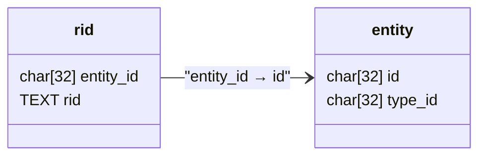

# Архитектура сущностей

1. Понятие [сущности](./glossary/Сущности.md) - средство описания объектов, 
явлений и понятий реального мира. Сущность следует рассматривать как абстрактный 
элемент, для описания свойств.


# Оглавление
1. [Авторы](#авторы)
0. [Теория](#теория)
0. [Практика](#практика)
0. [Организация-хранения-сущностей](#организация-хранения-сущностей)


# Авторы

1. https://github.com/johnthesmith/
2. https://github.com/igptx


# Теория

1. Для сущности неоходимо минимально определить:
    1. факт существования;
    0. типа сущности. 
0. Все иные описания и свойства сущности следует признать вторичными.
0. Так же следует определить операции с сущностью:
    1. [Создание сущности](#define)
    0. [Проверка существования](#exists)
    0. [Удаление сущности](#delete)


# Практика

1. Для хранения созданных сущностей потребуется отношение кортежей со следующими 
атрибутами:
    1. id - идентификатор сущности;
    0. type - идентификатор типа сущности ( который в свою очередь является сущностью ).
2. Так как [условлена](#теория) невозможность определения сущности без типа,
следует определить первую корневую самотипизирующуюся сущность:
```
[
    {
        "id":"entity",
        "type":"entity"
    }
]
```

> **Важно!** 
> Определение кортежа фактически создает новую реальность, которая 
> далее будет развиваться добавлением сущностей и описанием их свойств.

4. Например:
```
[
    { "id":"animal",    "type":"entity" },
    { "id":"cat",       "type":"animal" },
    { "id":"human",     "type":"animal" }   
]
```


# Организация хранения сущностей

1. В базовом варианте для хранения сущностей необходимо определить два отношения:
    1. [entity](#отношение-entity) - сущности;
    0. [rid](#отношение-rid) - читаемые идентификаторы.

## Отношение entity

1. Содержит следующие атрибуты:
    1. char[32] id - 
1. Отношенеи хранит перечень всех сущностей.
0. Предпочтение отдается операциям insert.
0. Допустикм





# Методы взаимодействия с сущностью

1. Реализцаяи предполагает следующие методы:
    1. [define](#define) - определение сущности;
    2. [check](#check) - проверка существования сущности;
    3. [kill](#kill) - удаление сущности.
2. Указанные методы опционально могут использовать [многомерное представление].


## define

1. Метод define устанавливает (типизирует сщность).
2. В случае 
    1. если сущность отсутствовала, она определяется.
    0. если сущность существовала
        1. и при этом обладала тем же типом, возвращается положительный результат.
        2. и при этом с иным типом, возвращается сообщение об ошибке.

### aргументы define

1. Метод define принимает следующие аргументы:
    1. ```string id``` - Идентификатор сущности;
    2. ```string itType``` - идентификатор типа сущности;
    3. ```array string dim[]``` - массив измерений.

### результат define

1. Метод define возвращает структуру состояний результата.

### алгоритм define

```
json define
(
    /* Идентификтаор типа сущности */
    string ridType, 
    /* Опциональный идентификатор сущности */
    string rid = null, 
    /* Опциональные измерения */
    array string dim[] 
)
{
    switch( algorithm )
    {
        AUTOINCREMENT:
        {
            /*
                Механизм идентификации на основе автоинкремента 
            */
            /* Получаем очередной автоинкрементный индекс */
            id = max( id ) + 1;
            /* Получаем иднетификатор типа если он существует */
            idType = rid 
            -> select({ caption == ridType }) 
            -> get( "endity_id" );
        }
        HASH:
        {
            /*
                Механизм идентификации на основе hash
            */
            /* Вычисляем hash для идентификатора сущности */
            id = hash( rid == null ? getId() : rid );
            /* Вычисляем hash для типа сущности */
            idType = hash( ridType );
            if( !entity -> exists( idType ))
            {
                idType = null;
            }
        }
    }

    if( idType != null )
    {
        /* Проверяем наличие rid для его опциональной регистрации ... */
        if( rid != null && rid -> exists( rid ))
        {
            /* ... и если rid не обнаружен регистрируем его  */
            rid -> insert( "entity_id":id, "rid":rid );
        }

        /* Создаем сущность с идентфикатором id */
        entity -> insert( "id":id, "type_id":idType );

        /* Возвращаем положительный результат с новым идентификатором сущности */
        result = { "code":"ok", "id":id };
    }
    else
    {
        if( rid == ridType )
        {
            /* Регистрируем новый домен */
            rid -> insert( "entity_id":id, "rid":rid );
            entity -> insert( "id":id, "type_id":id );            
            result = { "code":"ok", "id":id };
        }
        else
        {
            /* Информируем пользователя об отсутсвии сущности */
            result = { "code":"unknown_type" );
        }
    }
}


## check

1. Метод check возвращает возвращает тип сущности в случае, если она была 
определена или пустой результат в противном случае.

### aргументы check

1. Метод check принимает следующие аргументы:
    1. ```char32 id``` - Идентификатор сущности;

### результат check

1. Метод define возвращает структуру состояний результата c указанием типа 
сущности.

### алгорим check

```
json check
(
    /* Идентификатор сущности */
    char32 id
)
{
    /* Выполняем поиск сущности по идентификатору */
    dataset = entity -> select({ "id":"id" });

    /* Проверка результата поиска ... */
    if( dataset != null )
    {
        /*
            Запись найдена, выполняем определение типа из кортежа
        */
        idType = dataset -> get( "type_id ");
        /* Проверка наличия типа */
        if idType == null )
        {
            /* Тип не указан, cущность была удалена */
            result = { "code":"entity_not_found" }
        }
        else
        {
            /* 
                Удалось определить идентификатор тип и необходимо
                получить его название
            */
            datasetRid = rid -> select({ "entity_id": idType });
            if( datastRid != null )
            {
                /* Возвращаем тип результата */
                result = 
                {
                    "code":"ok", 
                    "ridType":datasetRid -> get( "rid" ),
                    "idType":idType
                };
            }
            else
            {
                /* 
                    Имя типа сущности не найдено что является 
                    исключительной ситуацией 
                */
                result = { "code":"type_name_not_found" }
            }
        }
    }
    else
    {
        /* Сущность не найдена */
        result = { "code":"entity_not_found" }
    }
}
```


## rid2id

## id2rid


## delete

1. Метод del пытается удалить сущность по идетификатору.
2. При наличии сущности она будет удалена с подтверждением результата удаления.
3. При отсутсвии сущности возвращается инфомрация об отсутсвии сущности.
4. Метод не пытается проверить целостность ссылок на сущности, а потому может 
быть удалена любая из сущностей.

### вызов delete

``` 
bool del( string id, array string dum[] )
```

### аргументы del

1. Метод del принимает следующие аргументы:
    1. ```string id``` - Идентификатор сущности;
    2. ```array string dim[]``` - массив измерений.

### результат del

1 Метод del возаращет положительный результ, если cущность после попытки 
удаления, и отрицательный результат если сущность осталась.


