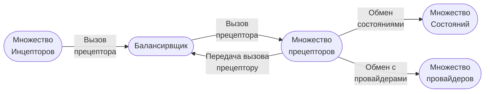
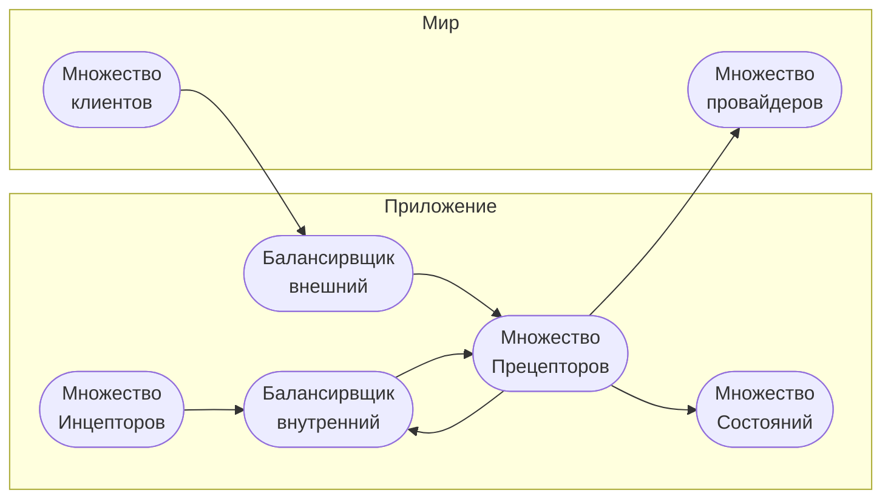

# Микросервисная архитектура на основе разделения инициативы и исполнения

1. Раздел описывает подход к реализации [МСА](./glossary/МСА.md) на основе 
принципиального разделения функций инициативы и исполнения [бизнес 
процессов](./glossary/Бизнеспроцесс.md) между различными сервисами.

# Определения

1. [Инцептор](./glossary/Инцептор.md) – сервис обладающий инициативой, подает сигнал на 
исполнение Прецептору.
0. [Прецептор](./glossary/Прецептор.md) – прецептор исполняет логику приложения.


3. Взаимодействие между Инцептором и Прецептором представляется как функция 
результата от аргументов: ```r = f( a )```, где Инцептор передает фиксированный 
перечень аргументов Прецептору, который выполняет реализацию действие 
[Rig](./glossary/Rig.md) и возвращает результат состояние.
4. Инцептор на основе состояния определяет момент следующего вызова.

# Цели

1. Разделение инициативы и исполения выполнено по следующим причинам:
    1. [Обеспечение отказоустойчивости](#Обеспечение-отказоустойчивости)
    2. [Распределение нагрузки](#Распределение-нагрузки)

## Обеспечение отказоустойчивости

1. Объединение функций инициации и исполнения создаёт риск остановки процесса 
из-за сбоев в сложной логике. Разделение позволяет Инцептору надёжно запускать 
задачи, даже если Прецептор выходит из строя.

## Распределение нагрузки 

1. Прецепторы выполняют ресурсоёмкие задачи, Инцепторы запускают их в нужном 
количестве, гарантируя непрерывное параллельное выполнение.

# Балансировка нагрузки

1. Для исключения необходмиости информирования Инцепторов о множестве 
Прецепторов, а так же для обеспечения автоматической балансировки нагрузки схему 
следует дополнить компонентом Балансировщиком. Выбор уровня балансировки (L3, 
L4, L7) статья не рассматрвиает.


# Работа c прецептором

1. Для исполнения бизнесполцессов Прцепторам необходимо:
    1. выполнять взаимодействие с хранилищами состояний;
    0. выполнять взаимодейсвие с иными сервисами (Провайдерами);
    0. выполнять взаимодействие с иными Прецепторами для передачи вызова.
2. С учетом изложенного следует расширить схему следующим образом:




# Резюме



