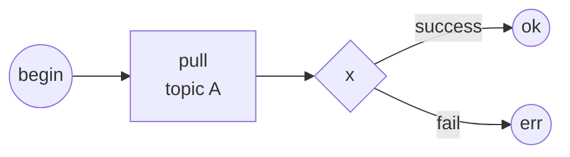
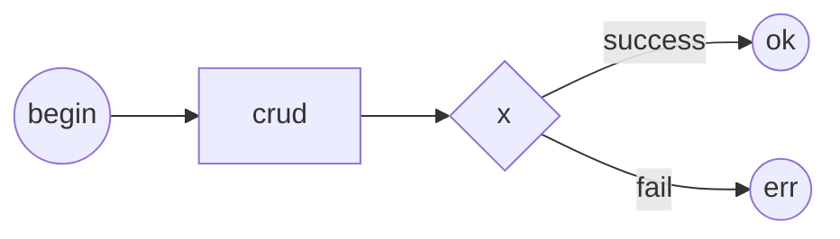
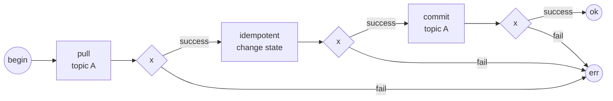
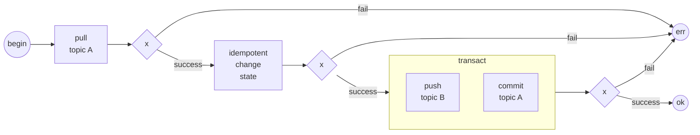
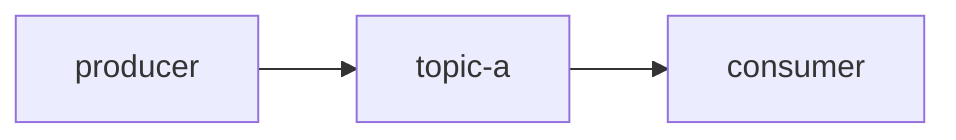
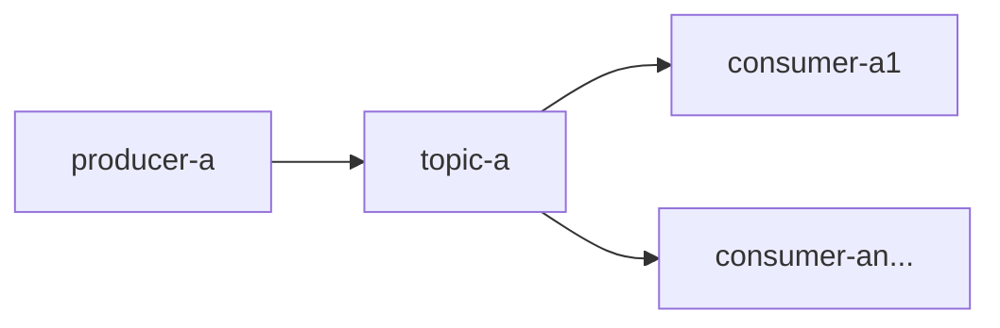
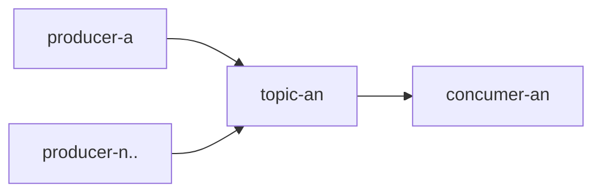

# Хранилища состояний в SIAMA

1. SIAMA предполагает атомизацию компонентов.
0. На основе [Решения](@queue_issue_and_resolve) SIAMA предполагает 
исключительно следующие способы хранилища состояний:
    1. Взаимодейсвтие с очередью
    0. Взаимодействие с сервисами
    0. Взаимодействие с БД.
0. Иные способы взаимодействия не рекомендуются.
0. Далее рассматриваются синхронные потоки.
0. Все синхронные потоки исходят из возможности повторного вызова вызывающей стороной.

#  Регистрация внешних событий 

1. Регистрация внешних событий выполняется как первичный прием состояния от 
стороны не гарантирующей повторый вызов требует минимального взаимодействия 
возвратом положительного или отрицательного результата для вызывающей стороны.
0. Для очереди:

3. Для БД (не рекомендуется так как влечет за собой патрулирование БД):

4. Иное не допускается.

# Обработка событий

1. При обработке событий выполняется изменение состояний (DB, вызов сервисов, 
иное).
0. Под изменением состояний подразумевается запись в БД или вызов стороннего 
сервиса изменяющего состояние, при этом SIAMA использует очередь или планировщик 
для квантования задач.
0. На изменение состояния накладывается требование идемпотентности.
0. Исключается использование неидемпотентного вызова.
0. Допускается, но не рекомендуется серия идемпотентных вызовов для изменения 
множества состояний.

## Формирование внутренних событий

1. Формирование внутренних событий осуществляется путем размещения сообщений в 
очереди или планировщике.
0. Размещение новых событий в очереди или планировщике идентично.
0. SIAMA требует возможность выполнения множетсва операций с очередью над 
разными топиками в одной транзакции.
0. Допускается но не рекомендуется pull результатов обработки более чем в один 
топик.

3. Иное не допускается.

# Схемы обработки очереди и планировщика

1. Допускаются следующие схемы:

## Линейная обработка

## Паралельная обработка топика разными продюсерами

1. Решает задачу паралельной обработки без необходимости синхронизации.
0. Требует возможности обработки одного топика очереди или планировщика 
консюмерами на основе индивидуальных офсетов.

## Формирование событий различными продюсерами

## Синхронизация топиков

1. Для синхронизации нескольких топиков используется 
[синхронизатор](синхронизатор), принимающий один из стэйтов для бизнеспроцесса и 
возвращающий результат завершения бизнеспроцесса.
0. Каждый из исполнителей процессов для синхронизации обязан после выполнения 
своей работы информаировать синхронизатор о завершении своей части работы.
