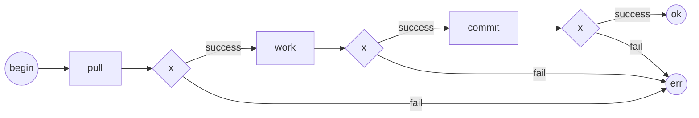
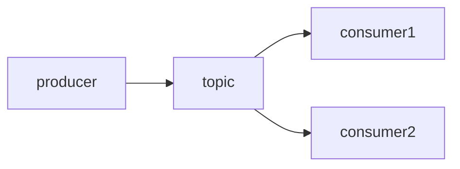

# Хранилища состояний в SIAMA

1. SIAMA предполагает атомизацию компонентов.
0. На основе [Решения](@queue_issue_and_resolve) SIAMA предполагает 
исключительно следующие способы хранилища состояний:
    1. Взаимодейсвтие с очередью
    2. Взаимодействие с сервисами
    4. Взаимодействие с БД.
0. Иные способы взаимодействия не рекомендуются.

#  Изменение состояний DB

1. Под изменением состояний подразумевается запись в БД или вызов стороннего 
сервиса изменяющего состояние.
0. На изменение состояния накладывается требование идемпотентности.
0. SIAMA использует очередь для квантования задач.
0. Использование неидемпотентного вызова нарушает гарантию консистентности.

## Обработка очереди

## Объединение событий
