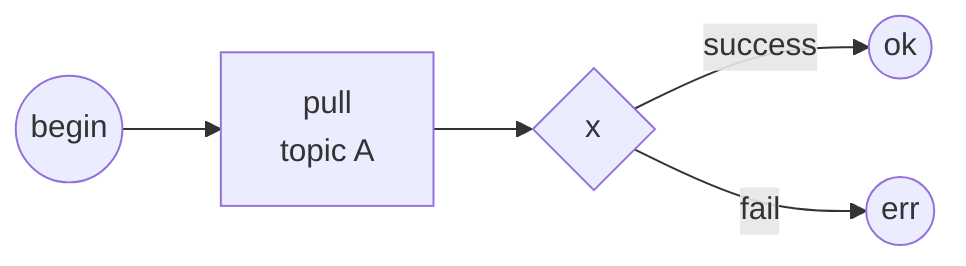
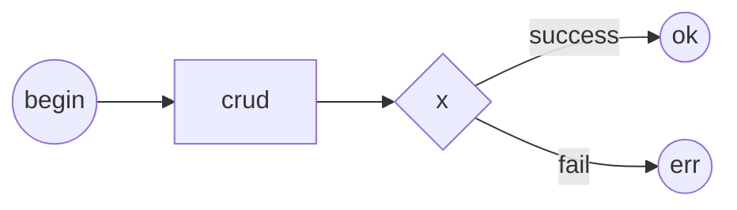
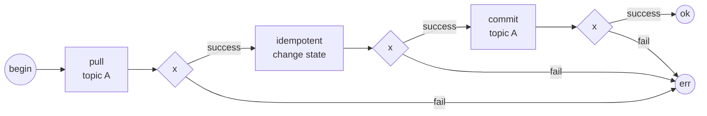
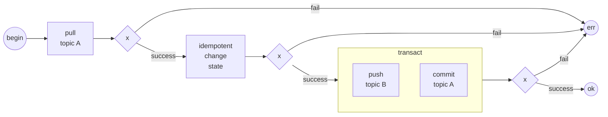

# Хранилища состояний в SIAMA

1. SIAMA предполагает атомизацию компонентов.
0. На основе [Решения](@queue_issue_and_resolve) SIAMA предполагает 
исключительно следующие способы хранилища состояний:
    1. Взаимодейсвтие с очередью
    0. Взаимодействие с сервисами
    0. Взаимодействие с БД.
0. Иные способы взаимодействия не рекомендуются.
0. Далее рассматриваются синхронные потоки.
0. Все синхронные потоки исходят из возможности повторного вызова вызывающей стороной.

#  Первичный прием состояния

1. Первичный прием состояния от стороны не гарантирующей повторый вызов требует 
минимального взаимодействия возвратом положительного или отрицательного 
результата для вызывающей стороны.
0. Иное не допускается.
0. Для очереди:

4. Для БД.

#  Изменение состояний DB

1. Под изменением состояний подразумевается запись в БД или вызов стороннего 
сервиса изменяющего состояние.
0. На изменение состояния накладывается требование идемпотентности.
0. SIAMA использует очередь для квантования задач.
0. Исключается использование неидемпотентного вызова.
0. Допускается, но не рекомендуется серия идемпотентных вызовов для изменения 
множества состояний.

## Размещение событий в очереди или планировщике

1. Размещение новых событий в очереди или планировщике идентично.
0. SIAMA требует возможность выполнения множетсва операций с очередью над 
разными топиками в одной транзакции.

