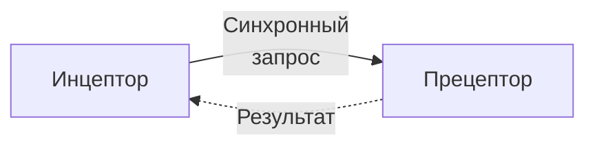
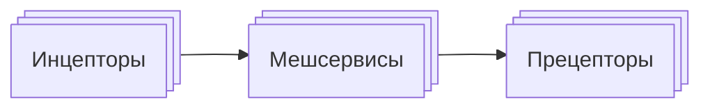
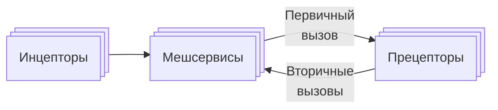
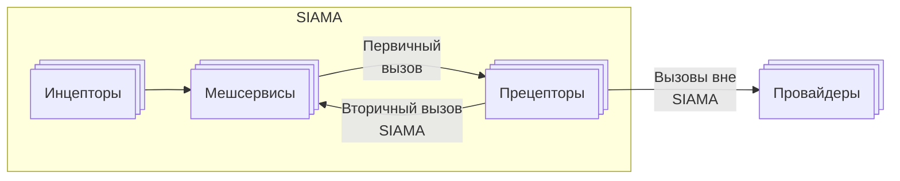
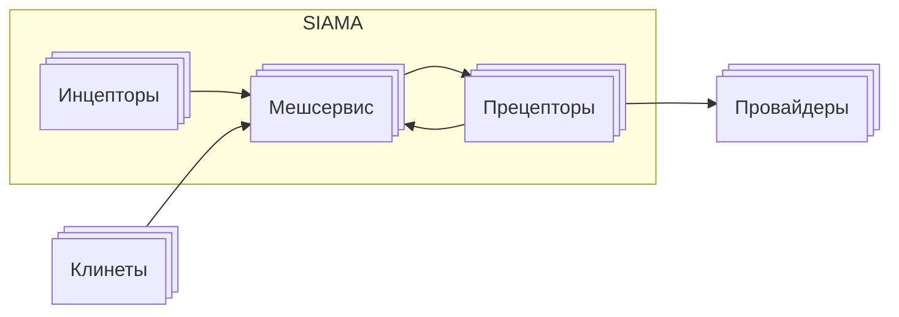

# SIAMA 

1. Separation of Initiative & Action Microservice Architeture - микросервисная 
архитектура на основе разделения инициативы и действия описывает подход к 
реализации [МСА](./glossary/МСА.md) при котором старт любого [бизнес 
процесса](./glossary/Бизнеспроцесс.md) всегда выделен в отдельный микросервис с 
минималистичным функционалом.

# Оглавление

1. [Определения](#Определения)
0. [Причины разделения инициативы и действия](#Причины-разделения-инициативы-и-действия)
0. [Обеспечение отказоустойчивости](#Обеспечение-отказоустойчивости)
0. [Распределение нагрузки](#Распределение-нагрузки)
0. [Работа прецептора](#Работа-прецептора)
0. [Мешсервис](#Мешсервис)
0. [Вторичные вызовы прецептора](#Вторичные-вызовы-прецептора)
0. [Внешний мир](#Внешний-мир)
0. [Синхронные запросы](#Синхронные-запросы)
0. [Асинхронные](#Асинхронные-запросы)

# Определения

1. [Прецептор](./glossary/Прецептор.md) – сервис исполнитель логики приложения.
0. [Инцептор](./glossary/Инцептор.md) – сервис, обладающий инициативой, подает 
сигнал на исполнение Прецептору.



> **Термины** 
> Прецептор и Инцептор введены для явного указания на конкретные 
> роли в SIAMA.


3. Взаимодействие между Инцептором и Прецептором представляется как функция 
результата от аргументов: ```R = f( A )```, Инцептор передает фиксированный 
перечень аргументов A Прецептору, который выполняет 
[реализацию](./glossary/Rig.md) и возвращает результат-состояние R.

4. Инцептор на основе состояния определяет момент следующего вызова.

> **Принципиальное ограничение**
> Инцептор не управляет Прецептором после передачи вызова.
> Он лишь инициирует выполнение, а дальнейший процесс полностью
> контролируется Прецептором без обратного вмешательства.


# Причины разделения инициативы и действия

1. Разделение инициативы и действия выполнено по следующим причинам:
    1. [Обеспечение отказоустойчивости](#обеспечение-отказоустойчивости)
    2. [Распределение нагрузки](#распределение-нагрузки)


# Обеспечение отказоустойчивости

1. Объединение функций инициации и исполнения создаёт риск остановки процесса  
   из-за потенциальных сбоев логики. Разделение позволяет Инцептору надёжно  
   запускать задачи, даже если Прецептор выходит из строя.


# Распределение нагрузки 

1. Прецепторы выполняют ресурсоёмкие задачи, Инцепторы запускают их в нужном  
   количестве, гарантируя непрерывное параллельное выполнение.


# Работа прецептора

1. Прецептор является приложением, и ожидающим внешний синхронный вызов.
0. При получении вызова Прецептор излвекает из аргументов имя 
[реализаци](./glossary/Rig.md), выполняет ее, возвращая результат вызывающей 
стороне, при этом допускается динамическая загрузка реализации.


# Мешсервис

1. Для исключения необходимости информировать Инцепторы о всех Прецепторах 
используется специфические Прецепторы с ролью Мешсервисов (Service Mesh).
2. Они обладают информацией о всех имещихся Прцепторах, их способах 
вызова, результатах вызовов.

3. Адреса Мешсервисов явно доступны Инцепторам и Прецепторам. 
4. SIAMA допускает дополнительное использование L3 (например BGP Health 
Checking) для организации единой точки входа на Мешсервисы.


# Вторичные вызовы прецептора

1. В процессе исполнения действия Прецпеторы могут осуществить повторные вызовы 
иных Прецепторов, что позволяет распределять логику на единнообразных 
реализациях и распределять нагрузку на различеные инстансы в бзнеспроцессе.
2. Логика вызовов прецепторов может ветвится в зависимости от требований
бизнеспроцесса, но в конечном счете является синхронным процссом, возвращающим
Инцептору итоговый результат.




# Внешний мир


1. Помимо работы внутри SIAMA для исполнения бизнеспроцессов Прцепторам 
необходимо взаимодействие сервисами Провайдерами, которые могут быть хранилищами 
состояний или сервисам вне SIAMA;



2. SIAMA так же должна принимать входящие запросы от Клиентов, которые так 
же являются Инцепторами, но при этом обладают собственной логикой.
3. Запросы клиентов так же направляются на Мешсервис.




# Синхронные запросы

1. Синхронные запросы поступают в приложение со стороны Клиента.
0. При обработке запросов Прецепторы могут многократно вызывать друг друга через Балансировщик.
0. В процессе работы Прецепторы могут изменять состояния и взаимодействовать с Провайдерами.
0. Результат обработки цепочки запросов возвращается Клиенту.


# Асинхронные запросы

1. Асинхронные запросы выполняются по инициативе Инцепторов путем направления 
синхронного запроса от Инцептора к Мешсервису.
0. При обработке запросов Прецепторы могут многократно вызывать друг друга 
через Балансировщик.
0. Прецепторы могут изменять состояния и взаимодействовать с Провайдерами.
0. Результат обработки цепочки запросов возвращается Инцептору.


