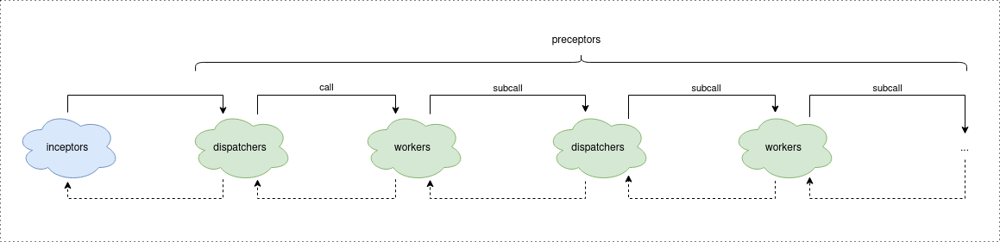
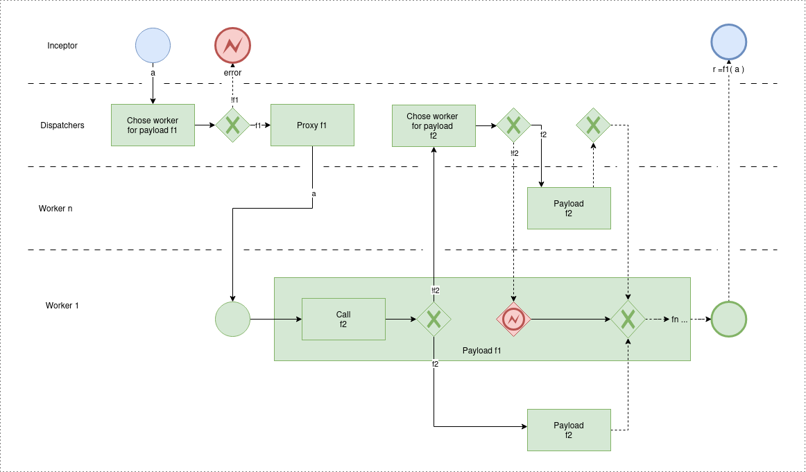
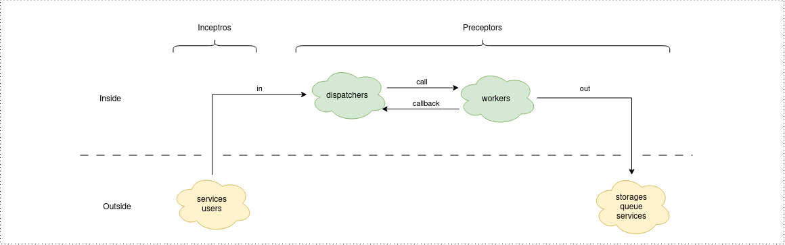
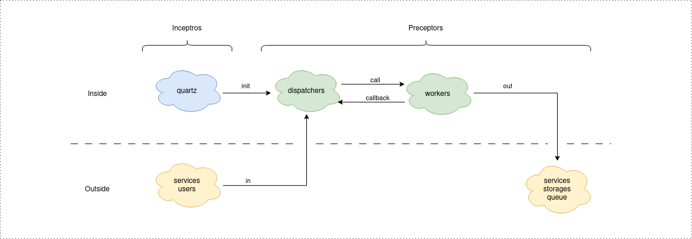
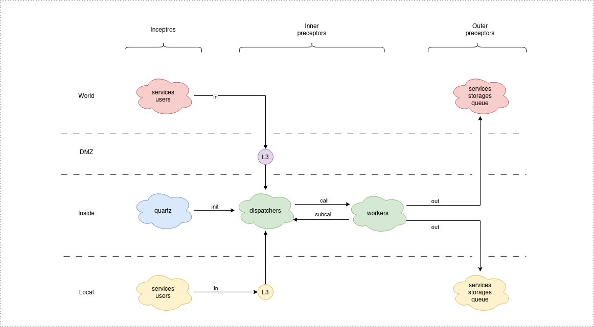

# SIAMA

1. Separation of Initiative & Action Microservice Architecture - микросервисная
архитектура на основе разделения инициативы и действия описывает подход к
реализации [МСА](./glossary/МСА.md) при котором старт любого
[бизнес-процесса](./glossary/Бизнеспроцесс.md) всегда выделен в отдельный
микросервис с минималистичным функционалом.

# Оглавление

1. [Определения](#определения)
0. [Разделение инициативы и действия](#разделение-инициативы-и-действия)
    1. [Обеспечение отказоустойчивости](#обеспечение-отказоустойчивости)
    0. [Распределение нагрузки](#распределение-нагрузки)
0. [Внешние и внутренние участники](#внешние-и-внутренние-участники)
0. [Инцептор Quartz](#инцептор-quartz)
0. [Прецепторы Диспетчеры и Исполнители](#прецепторы-диспетчеры-и-исполнители)
    1. [Worker](#worker)
    0. [Dispatcher](#dispatcher)
0. [Вторичные вызовы прецептора](#вторичные-вызовы-прецептора)
0. [Синхронные запросы](#синхронные-запросы)
0. [Асинхронные запросы](#асинхронные-запросы)
0. [Общая схема взаимодействия](#общая-схема-взаимодействия)

# Определения

1. Прецептор – сервис-исполнитель логики приложения.
2. Инцептор – сервис, обладающий инициативой, подает сигнал на исполнение.

> **Термины** 
> Прецептор и Инцептор введены для явного указания на конкретные 
> роли в SIAMA.

3. Взаимодействие между Инцептором и Прецептором описывается как функция,
зависящая от аргументов: `r = f( a )`. Инцептор передает фиксированный
перечень аргументов `a` Прецептору, который выполняет
реализацию `payload` как `f` и возвращает результат-состояние `r`.

> **Принципиальное ограничение**
> Инцептор не управляет Прецептором после передачи вызова.
> Он лишь инициирует выполнение, а дальнейший процесс полностью
> контролируется Прецептором без обратного вмешательства.

# Разделение инициативы и действия

1. Разделение инициативы и действия выполнено по следующим причинам:
    1. [Обеспечение отказоустойчивости](#обеспечение-отказоустойчивости)
    2. [Распределение нагрузки](#распределение-нагрузки)

## Обеспечение отказоустойчивости

1. Объединение функций инициации и исполнения создаёт риск остановки процесса
из-за потенциальных сбоев логики. Разделение позволяет Инцептору надёжно
запускать задачи, даже если Прецептор выходит из строя. При этом Инцептор
обладает минимальным функционалом с точки зрения SIAMA.

## Распределение нагрузки 

1. Прецепторы выполняют ресурсоёмкие задачи, Инцепторы запускают их в нужном
количестве, гарантируя непрерывное параллельное выполнение.

# Внешние и внутренние участники

1. С точки зрения SIAMA любой свой участник (Inner) будет либо Инцептором, если 
он инициирует вызов или Прецептором, если он принимает вызов.
2. С другой стороны о любом внешнем участнике (Outer) так же можно говорить как 
о Инцепторе, если он инициирует вызов или о Прецепторе, если он принимает вызов 
от SIAMA.

# Инцептор Quartz

1. Inner Инцептор находится в цикле и вызывает указанный Прецептор с перечнем 
жестко определенных аргументов.
2. По результату ответа (код состояния Прецептора) Инцептор определяет по 
собственной логике время следующего вызова Прецептора.
3. Между вызовами пребывает в спящем режиме.

# Прецепторы Диспетчеры и Исполнители

1. Так как множество Инцепторов должны взаимодействовать со множеством
Прецепторов, они должны иметь информацию об их сетевом размещении (минимально
host:port).
2. Для исключения необходимости информировать Инцепторы о всех Прецепторах
используются специальные Прецепторы с ролью Dispatcher (Диспетчер).
3. Они обладают информацией о всех остальных имеющихся Прецепторах Worker
(Исполнитель), выполняющих бизнес-функционал. Также Dispatcher обладает
информацией об их способах вызова, доступном функционале, результатах вызовов.

## Worker

1. Inner Прецептор Worker ожидает синхронный вызов от любого Инцептора (в том 
числе от Dispatcher) `payload/method/arguments`.
2.  Извлекает имя `payload`, выполняет соответствующую реализацию `method` и 
возвращает результат. Допустима динамическая загрузка реализации: `payload` может 
быть загружен и выполнен по требованию.
3.  Worker обязан предоставлять по запросу список поддерживаемых им `payload` для 
регистрации в таблицах маршрутизации Dispatcher'ов.
4.  Для Worker не рекомендуется внутренняя передача состояний между различными 
реализациями вне прямого вызова.

> **Примечание:** Worker — контейнер реализаций (payload). Dispatcher выбирает 
> Worker, основываясь на том, поддерживает ли тот нужный payload, а Worker уже по 
> имени payload загружает и выполняет конкретный код.

## Dispatcher

1. Inner Прецептор Dispatcher принимает входящий синхронный вызов, содержащий 
данные о требуемой работе (payload) `payload/method/arguments`.
2. Анализирует payload и определяет, какой именно функционал должен быть выполнен.
3. Обращается к внутренним таблицам маршрутизации, где хранится информация обо 
всех доступных Worker (исполнителях): их специализация, текущая нагрузка, 
доступность, результаты предыдущих вызовов.
4. На основе этих данных выбирает оптимального Worker для выполнения конкретной задачи.
5. Проксирует (перенаправляет) вызов на выбранного Worker, передавая ему исходные аргументы.
6. Если выбранный Worker недоступен или возвращает ошибку, Dispatcher может 
повторить попытку, выбрав другого Worker'а, способного выполнить данный payload 
(гарантия доставки обеспечивается механизмом синхронного повтора).
7. Получает результат от Worker и возвращает его вызвавшему Инцептору.
8. Так как Dispatcher'ов тоже множество, для организации единой точки входа 
используется L3-балансировка, распределяющая входящие вызовы между ними.

# Вторичные вызовы прецептора

1. В процессе исполнения действия Workers могут осуществить повторные вызовы
иных Workers, что позволяет распределять логику на единообразных реализациях и
распределять нагрузку на различные инстансы в одном бизнес-процессе.

2. Логика вызовов прецепторов может ветвиться в зависимости от требований
бизнес-процесса, но в конечном счете это синхронный процесс, возвращающий
Инцептору итоговый результат как `r = f1( a ), f1 ​= fn ​∘ ⋯ ∘ f2`.

# Синхронные запросы

1. Синхронные запросы поступают в приложение со стороны Outer.
0. Как ранее указывалось при обработке запросов Workers могут многократно 
вызывать друг друга через Dispatcher синхронными вызовами (subcall).
0. В процессе работы Исполнители могут изменять состояния и взаимодействовать с Внешними Прецепторами.
0. Результат обработки цепочки запросов возвращается Клиенту.

# Асинхронные запросы

1. Асинхронные запросы выполняются по инициативе внутренних инцепторов Quartz
путем направления синхронного запроса от Quartz к Worker через Dispatcher.
2. При обработке запросов Worker также могут многократно вызывать друг друга
через Dispatcher (subcall).
3. Worker могут изменять состояния и взаимодействовать с внешними Прецепторами (Outer).
4. Результат обработки цепочки запросов возвращается Quartz, который на основе
результата принимает решение о следующем вызове по внутренней логике.

# Общая схема взаимодействия

