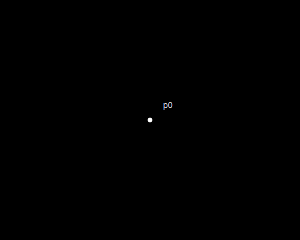
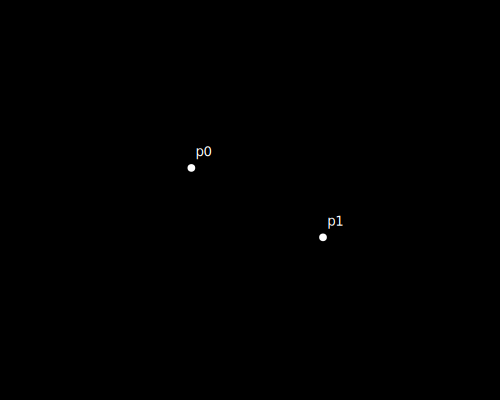

# Вступление

1. Попробуем создать собственное пространство, которое в основе должно быть максимально просто и не основываться на координатах, измеренийх, направлениях и прочих формальных конструктах.
Они должны проистекать из принципов, но не требовать явного определения.

# Сначало было слово

1. Декларируем множество точек P.
    1. точки не имеет координат.
0. Декларируем множество элементов A.
    1. каждый элемент имеет две ссылки на точки из множества P;
    0. последовательность указания точек не имеет значения.

# Да будет пространство

1. Создатим точку p0. Она единственное сущее. Точка своим появлением порождает собственное 0 мерное пространство.

2. Создаем точку p1.  Точка так же создает собственное 0 мерное пространство, не связанное с точкой p0. Расстояние и взаимное положение точек p0 и p1 не определено.

3. В массив A добавляем элемент [ p0, p1 ]. При этом появляется одномерное пространство, ограниченное двумя точками p0 и p1. Для точек могут быть названы координаты, относительно друг друга.
    1. Пример: 
        1. Относительно p0 определена коодината p1[1], аналогично относительно p1 так же есть координата p0[1].
4. И это хорошо. 
5. Создаем точку p2 и добавляем в массив А связь [ p1, p2 ].
6. Наше пространство расширяется при этом в нем появляется расстояние и направление.
    1. Точки p0 и p2 находятся на двух единичных расстояниях через точку p1.
    0. При этом они размещены в разных направлениях от p1.
7. Наращивать такое одномерное пространство можно сколь угодно, добавляя к крайним точкам новые.

## Двумерное пространство

1. Cоздаем точку p3 и добавляем в А связи [ P0, P3 ], [P1, P3 ].
2. 
0. Точки P0,P1,P2 создают двумерное пространство не имея собственных координат, так как образут равносторонний треугольник с длинной ребра w.
Например относительно p0 точки могут иметь двумерные координаты p1[cos(pi/3)*w, 0] и p3[cos(pi/3)*w, sin(pi/3)*w.
И это очень хорошо.

Важно: точка P2 по прежнему определена только в одномерном пространстве, таким образом одноврменно в одной модели описаны и двумерные и одномерные пространства.

Наращивать такое пространство можно так же сколь угодно, буквально расширяя его добавлением новых точек и связей. 

## Трехмерное пространство и большие размерности

Создаем новую точку p4 и добавляем ей связи [ P0, P4, w ], [P1, P4, w], [ p3, p4, w ].
Тем самым формируя трехмерное пространтство, где можно говорить о трехмерных координатах для каждой из точек. При этом мы по прежнему не изменяем первоначальной декларации.
Таким образом возможно расширение модели до любой размерности.

## Замкнутые конечные пространства

Создадим последовательность точек при этом каждую предыдущую свяжем с последующей а последнюю с первой.
Таким образом мы получим замкнутое бесшовное одномерное измерение. Аналогичным образом можно получить замкнутые измерения любой размерности и любой конфигурации.

Фактически из ничего мы создали расширяемый многомерный мир. Сейчас этот мир пуст и статичен. В нем нет движения, энергии, но он отменно подходит для их появления.

# Да будет свет

Ожидайте.

