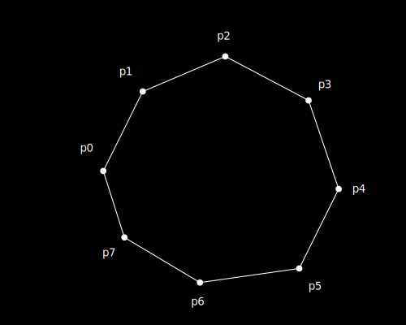

> :information_source: Cоздание универсального пространства любой размерности 
топологии и сложности, следует начинать с множества пар натуральных чисел и не более.

# Вступление

1. Попробуем создать собственное пространство, максимально простое, не основываясь 
на координатах, измерениях, направлениях и прочих формальных конструктах.
Все они должны проистекать из базового принципа, но не требовать явного определения.

# Сначало было слово

1. Декларируем множество точек P:
    1. точки не имеет координат.
0. Декларируем множество элементов A:
    1. каждый элемент содержит две ссылки на точки из множества P;
    0. последовательность указания точек не имеет значения.

> :information_source: А - список пар натуральных числе, где каждое число определяет индекс точки P.

> :warning: Важно для понимания. Не следует пытаться трактовать все последующие рисуноки 
как координатные пространства в которых размещены точки и связи между ними. 
Рисунки - лишь попытка иллюстрации, а сами объекты и есть пространство.

# Да будет пространство

1. Создатим точку p0 в P. Она единственное сущее. Точка своим появлением порождает собственное 0 мерное пространство за пределами которго нет ничего.

2. Создаем точку p1.  Точка так же создает собственное 0 мерное пространство, не связанное с точкой p0. Расстояние и взаимное положение точек p0 и p1 не определено.

3. В массив A добавляем элемент [ p0, p1 ]. При этом появляется одномерное пространство, ограниченное двумя точками p0 и p1. 
Каждый элемент в массиве А является мельчайшим единичным квантом пространства, соответсвенно для точек могут быть названы координаты, относительно друг друга. 
Относительно p0 возможно говорить о коодинате p1[1], аналогично относительно p1 о p0[1].

4. Создаем точку p2 и добавляем в А связь [ p1, p2 ].
5. Наше одномерное пространство расширяется при этом в нем появляется расстояние и направление.
    1. Точки p0 и p2 находятся на двух единичных расстояниях через точку p1.
    0. При этом они размещены в разных направлениях от p1.

6. Наращивать такое одномерное пространство можно сколь угодно, добавляя к крайним точкам новые.

> :information_source: И это хорошо. 

## Двумерное пространство

1. Cоздаем точку p3 и добавляем в А связи [ P0, P3 ], [P1, P3 ].

2. Так как p0p1 = p0p3 = p1p3 = 1, иными словами они находятся друг от друга наравном расстоянии, то они выходят за одномерного пространства, и создают ограниченное собой двумерное пространство.
3. Можно говорить о координатах. Например относительно p0 возможно определение p1[cos(pi/3);0] и p3[cos(pi/3);sin(pi/3)]. При этом точка p2 имеет одномерную координату p2[2].
4. Важно: точка P2 по прежнему определена только в одномерном пространстве, таким образом в единой модели описаны и двумерные и одномерные пространства.
5. Наращивать такое пространство можно так же сколь угодно, буквально расширяя его добавлением новых точек и связей. 

## Трехмерное пространство и большие размерности

1. Создаем новую точку p4 и добавляем ей связи [ P0, P4, w ], [P1, P4, w], [ p3, p4, w ].

2. По аналогии с двумя измерениями формрируется трехмерное пространтство, где можно говорить о трехмерных координатах для каждой из точек.
3. Таким образом возможно расширение модели до любой размерности.

## Замкнутые конечные пространства

1. Cозданное двумерное пространство точками p0 p2 p3, можно так же интерпритировать как замкнутое одномерное пространство. В случае с тремя точками это не столь очевидно. 
2. Создадим последовательность точек, при этом каждую предыдущую свяжем с последующей а последнюю с первой. Таким образом мы получим замкнутое бесшовное одномерное измерение.

3. Аналогичным образом можно получить замкнутые пространства любой размерности и любой конфигурации, при этом можно говорить о формировании высших измерений.

## Кротовые норы

1. Пространства допускают формирование кротовых нор без нобходимости искривления.

0. Одномерное пространство от точки p0 в точку p7 линейно равномерно, неразрывно и имеет длинну 7 единиц.
0. При этом связь p1-p6 добавляет альтернативное линейное неразрываное пространство p0-p7 размером 3 единицы.
0. Аналогичный результат достижим для любой размерности.

## Расширение пространства и его кривизна

1. Допустимо произвольное расширение как всего пространства так и его отдельных областей.
Для растяжения достаточно создание новых точек и их связь с двумя соседними с удалением ранее существующей связи.
0. При неравномерном расширении пространства размерностей 2 и более можно говорить о его кривизне через большие измерения.

## Домены

1. Допустимо создание изолированнх областей пространств (доменов), которые могут быть связаны между собой переходами или быть полностью изолированными друг от друга.
В последнем случае они смогут оказывать друг на друга никакого влияния.

## Итог

1. Из ничего мы создали расширяемый многомерное пространство. Пока оно пусто и статичено. 
Хотя мы уже говорили о длинне и рамерах, в пространстве не определено еще время движение и скорость, но они уже близко. 

Да будет свет!

