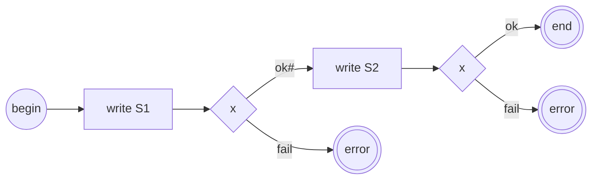
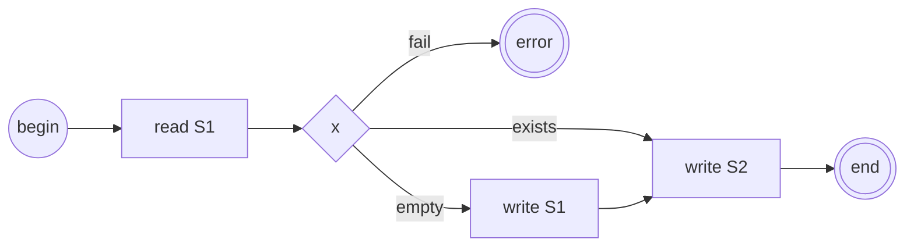

# Проблема гарантии консистентности двух и более состояний

1. Статья
    1. описывает проблему гарантии полноты и неизбыточности при последовательной 
       установке двух [состояний](./glossary/Состояние.md);
    0. выдвигает гипотезу о невозможности разрешения проблемы без участия 
       состояний (без [идемпотентности](https://ru.wikipedia.org/wiki/%D0%98%D0%B4%D0%B5%D0%BC%D0%BF%D0%BE%D1%82%D0%B5%D0%BD%D1%82%D0%BD%D0%BE%D1%81%D1%82%D1%8C) состояний);
    0. предлагает [Общее решение](general_solution_to_the_state_preservation_problem.md).

# Задача

1. [Поток](./Термины/Поток) T должен установить два состояния S1 и S2.
0. S1 и S2 возвращают синхронный ответ при успехе сохранения и не более.
0. Требуется гарантировать полноту и не избыточность установки состояний.

# Проблема

1. Поток Т выполняет запись в S1.
    1. При провале поток Т возвращает отказ.
    0. При успехе поток Т должен выполнить запись в S2.
        1. Начиная с этого момента возникает **проблема** неопределенности при ошибке установки S2 или крахе потока Т.
            1. состояние S1 уже установлено, а S2 не установлено;
            0. однозначно не определен результат исполнения потока T;
            0. повторный вызов потока Т не разрешит ситуацию.

# Гипотеза

1. Не существует решения при котором поток Т гарантирует полноту и неизбыточность 
установки двух состояний, при том что состояния возвращают исключительно синхронный
ответ о результате сохранения.
0. Никакие механизмы со стороны Т не могут разрешить указанную проблему 
без [идемпотентности](https://ru.wikipedia.org/wiki/%D0%98%D0%B4%D0%B5%D0%BC%D0%BF%D0%BE%D1%82%D0%B5%D0%BD%D1%82%D0%BD%D0%BE%D1%81%D1%82%D1%8C) S1.

# Варианты решения

1. Состояние S1 должно быть идемпотентным например: 
    1. защита от дублированного получения данных;
    0. возможность оповещения T по его инициативе о результатах сохранения.
0. T должен обладать возможностью повтора установки состояний при отказе.

# Ссылки

1. [Общее решение проблемы сохранения состояний](general_solution_to_the_state_preservation_problem.md)
