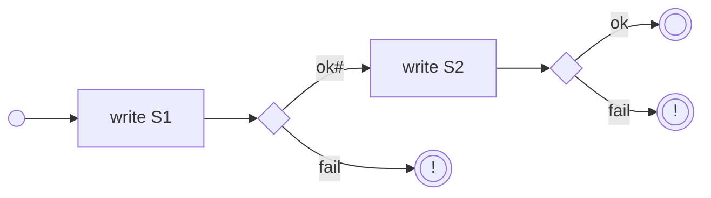
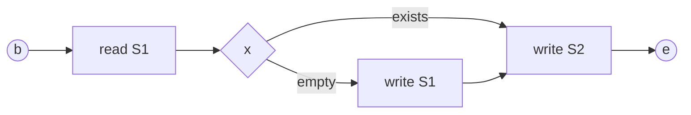

# Проблема гарантии полноты и неизбыточности установки двух состояний

1. Статья
    1. описывает проблему гарантии полноты и неизбыточности при последовательной 
    установке двух [состояний](./Термины/Состояние).
    0. выдвигает гипотезу о невозможности разрешения проблемы без участия 
    состояний (без идемпотентности состояний).

# Задача

0. [Поток](./Термины/Поток) T должен установить два состояния S1 и S2.
0. S1 и S2 возвращают синхронный ответ при успехе сохранения и не более.
0. Требуется гарантировать полноту и не избыточность установки состояний.

# Проблема

1. Поток Т выполняет запись в S1.
    1. При провале Поток Т возвращает отказ.
    0. При успехе поток Т выполняет запись в S2.
        1. При провале возвращается отказ, и возникает **проблема** при
        которой состояние S1 уже установлено, а S2 не установлено.
        0. При успехе задача завершена.

# Гипотеза

1. Не существует решения при котором поток Т гарантирует полноту и неизбыточность 
установки двух состояний, при том что состояния возвращают исключительно синхронный
ответ о результате сохранения.
0. Никакие механизмы со стороны Т не могут разрешить указанную проблему 
без идемпотентности S1.

# Варианты решения

1. Состояние S1 должно быть идемпотентным например: 
    1. защита от дублированного получения данных;
    0. возможность оповещения T по его инициативе о результатах сохранения.
0. T должен обладать возможностью повтора установки состояний при отказе.

# Ссылки

1. [Общее решение проблемы сохранения состояний](Общее_решение_проблемы_сохранения_состояний)
